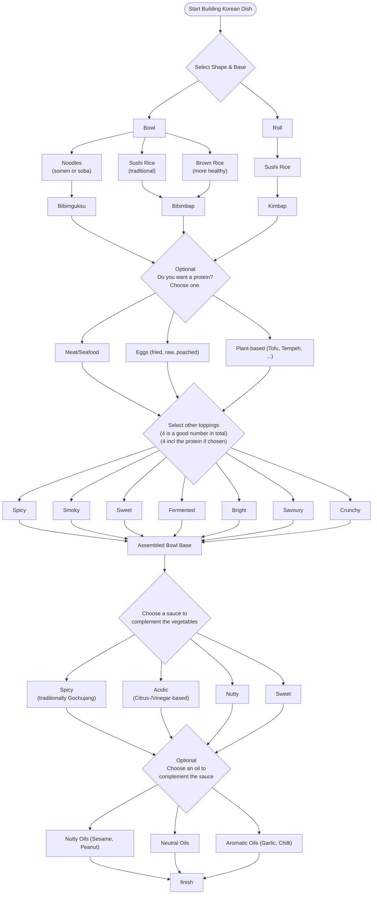

Below, you can find a flow chart to easily construct a nice bowl of Korean food.
This is a high level scheme. For more information on each component, the following pages will help.

```mermaid
graph TD
    start(["Start Building Korean Dish"])

    %% Base Layer
    Shape{"Select Shape & Base"}
    start --> Shape
    
    Shape --> Shape_Roll["Roll"]
    Shape --> Shape_Bowl["Bowl"]
    
    Rice_sushi_roll["Sushi Rice"]
    Shape_Roll --> Rice_sushi_roll
    Rice_sushi_roll --> kimbap["Kimbap"]
   
    Shape_Bowl --> Rice_sushi["Sushi Rice<br/>(traditional)"]
    Shape_Bowl --> Rice_brown["Brown Rice<br/>(more healthy)"]
    Bibimbap["Bibimbap"]
    Rice_sushi --> Bibimbap
    Rice_brown --> Bibimbap
    
    Shape_Bowl --> Noodles["Noodles<br/>(somen or soba)"]
    Noodles --> Bibimguksu["Bibimguksu"]

    %% Protein Layer
    Protein{"Optional<br/>Do you want a protein?<br/>Choose one."}
    Bibimguksu --> Protein
    Bibimbap --> Protein
    kimbap --> Protein
    Protein --> Animal["Meat/Seafood"]
    Protein --> Eggs["Eggs (fried, raw, poached)"]
    Protein --> Plant["Plant-based (Tofu, Tempeh, ...)"]

    %% Vegetables Layer
    Vegetables{"Select other toppings<br/>(4 is a good number in total)<br/>(4 incl the protein if chosen)"}
    Animal --> Vegetables
    Eggs --> Vegetables
    Plant --> Vegetables
    Vegetables --> V_Spicy[Spicy]
    Vegetables --> V_Smoky[Smoky]
    Vegetables --> V_Sweet[Sweet]
    Vegetables --> V_Fermented[Fermented]
    Vegetables --> V_Bright[Bright]
    Vegetables --> V_Savoury[Savoury]
    Vegetables --> V_Crunchy[Crunchy]

	assembledbowl["Assembled Bowl Base"]
	V_Spicy --> assembledbowl
	V_Smoky --> assembledbowl
	V_Sweet --> assembledbowl
	V_Fermented --> assembledbowl
	V_Bright --> assembledbowl
	V_Savoury --> assembledbowl
	V_Crunchy --> assembledbowl
	
    %% Sauce Layer
    sauce{"Choose a sauce to<br/>complement the vegetables"}
    assembledbowl --> sauce
    sauce --> sauce_Spicy["Spicy<br/>(traditionally Gochujang)"]
    sauce --> sauce_AcidicSauce["Acidic<br/>(Citrus-/Vinegar-based)"]
    sauce --> sauce_Nutty["Nutty"]
    sauce --> sauce_Sweet["Sweet"]

    %% Fat / Aroma Layer
    oils{"Optional<br/>Choose an oil to<br/>complement the sauce"}
    sauce_Spicy --> oils
    sauce_AcidicSauce --> oils
    sauce_Nutty --> oils
    sauce_Sweet --> oils
    oils --> Oils_NuttyOil["Nutty Oils (Sesame, Peanut)"]
    oils --> Oils_NeutralOil["Neutral Oils"]
    oils --> Oils_AromaticOil["Aromatic Oils (Garlic, Chilli)"]
    Oils_NuttyOil --> finish
    Oils_NeutralOil --> finish
    Oils_AromaticOil --> finish
```
