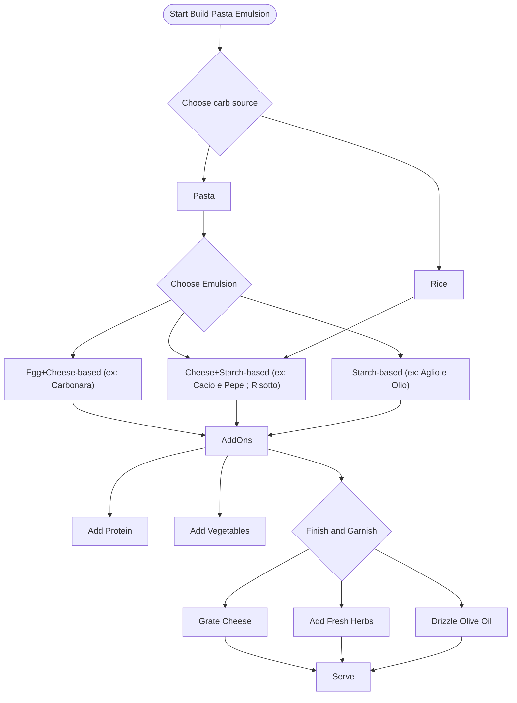

Below, you can find a flow chart to easily construct a refined cohesive dish.

```mermaid

flowchart TD
    Start([Start Build Pasta Emulsion])

    Start --> ChooseCarb{Choose carb source}
    
    ChooseCarb --> Pasta
    ChooseCarb --> Rice
    
    Pasta --> ChooseEmulsion{Choose Emulsion}

    ChooseEmulsion --> Carbonara["Egg+Cheese-based (ex: Carbonara)"]
    ChooseEmulsion --> CacioChoice["Cheese+Starch-based (ex: Cacio e Pepe ; Risotto)"] 
    ChooseEmulsion --> AglioOlio["Starch-based (ex: Aglio e Olio)"]
    
    Rice --> CacioChoice
    
    Carbonara --> AddOns
    CacioChoice--> AddOns
    AglioOlio --> AddOns

    AddOns --> AddProtein[Add Protein]
    AddOns --> AddVegetables[Add Vegetables]
    AddOns --> Garnish{Finish and Garnish}

    Garnish --> AddCheese[Grate Cheese]
    Garnish --> AddHerbs[Add Fresh Herbs]
    Garnish --> AddOil[Drizzle Olive Oil]

    AddCheese --> Serve
    AddHerbs --> Serve
    AddOil --> Serve
```
