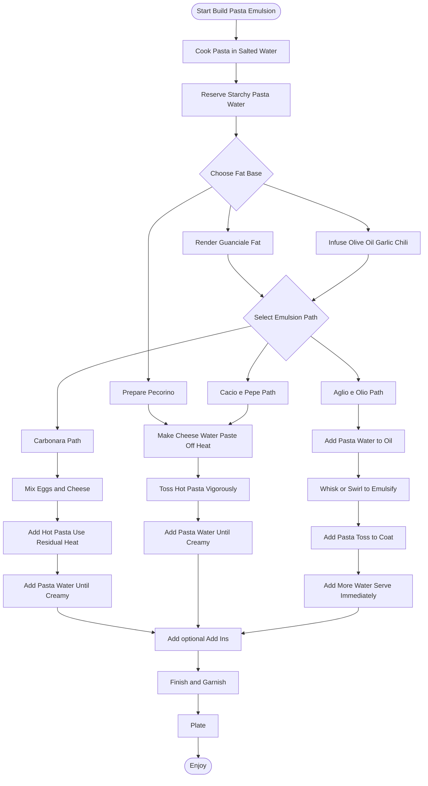

Below, you can find a flow chart on how the emulsion dishes come to exist.

```mermaid

flowchart TD
    Start([Start Build Pasta Emulsion])

    Start --> CookPasta[Cook Pasta in Salted Water]
    CookPasta --> ReserveWater[Reserve Starchy Pasta Water]

    ReserveWater --> PrepAromatics{Choose Fat Base}

    PrepAromatics --> Guanciale[Render Guanciale Fat]
    PrepAromatics --> OliveOil[Infuse Olive Oil Garlic Chili]
    PrepAromatics --> CheeseFat[Prepare Pecorino]

    Guanciale --> ChoosePath
    OliveOil --> ChoosePath{Select Emulsion Path}
    CheeseFat --> CacioPaste[Make Cheese Water Paste Off Heat]

    ChoosePath --> Carbonara[Carbonara Path]
    ChoosePath --> CacioChoice[Cacio e Pepe Path]
    ChoosePath --> AglioOlio[Aglio e Olio Path]

    Carbonara --> MixEggs[Mix Eggs and Cheese]
    MixEggs --> Temper[Add Hot Pasta Use Residual Heat]
    Temper --> AdjustCarbonara[Add Pasta Water Until Creamy]
    AdjustCarbonara --> AddIns[Add optional Add Ins]

    CacioChoice --> CacioPaste
    CacioPaste --> TossCheese[Toss Hot Pasta Vigorously]
    TossCheese --> AdjustCacio[Add Pasta Water Until Creamy]
    AdjustCacio --> AddIns

    AglioOlio --> AddWater[Add Pasta Water to Oil]
    AddWater --> Agitate[Whisk or Swirl to Emulsify]
    Agitate --> CombinePasta[Add Pasta Toss to Coat]
    CombinePasta --> AdjustAglio[Add More Water Serve Immediately]
    AdjustAglio --> AddIns

    AddIns --> Garnish[Finish and Garnish]

    Garnish --> Plate

    Plate --> End([Enjoy])

```
