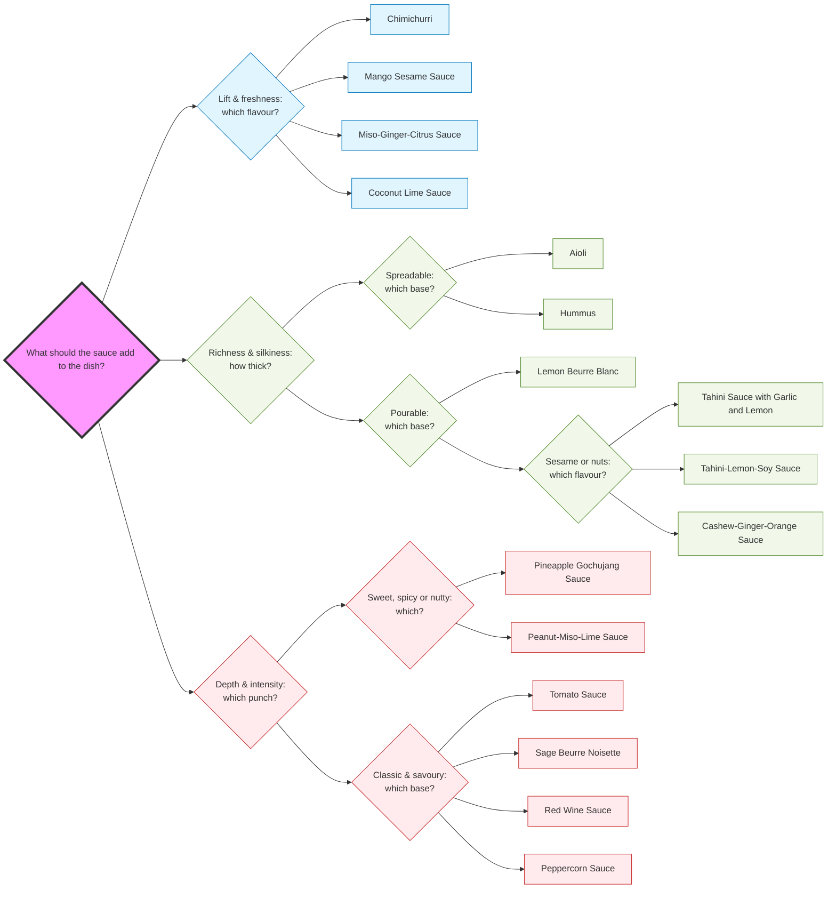

### Side info
- group: sideinfo
- subgroup: sideinfo

### Title
- title: Distinct Sauces

### Text
When pairing a sauce for a dish:

- Start with flavor
	- Match the sauce flavor to complement or contrast the vegetable (e.g., fresh & sharp sauce with bitter greens, rich & silky sauce with roasted root vegetables).
- Check the thickness
	- Ensure the thickness of the sauce matches the density of the vegetable. Light sauces for delicate veggies, heavy sauces for dense or fried items.
- Decide use mode
	- Consider how the sauce will interact with the vegetable in the dish - tossed, drizzled, dipped, spread, or glazed.

#### Sauce Profiling

| Radar Axis (0–5) | description                     |
| ---------------- | ------------------------------- |
| Acid         | citrus, vinegar, wine           |
| Richness     | butter, tahini, nut, mayo-style |
| Sweet        | sugary                          |
| Umami        | miso, soy, tomato, reduction    |
| Heat         | spiciness                       |
| Viscosity        | thickness                       |

#### Categorisation of Sauces
For ease of finding, all sauces have been put in one of three sections: 

- [[_3.4.1. Deep & Savoury|deep & savoury sauces]]
	- flavour is built by reduction, browning or fermentation, led by umami and usually served hot.
- [[_3.4.3. Fresh & Sharp|fresh & sharp sauces]]
	- Light, bright sauces led by acid, herbs or fruit, meant to lift a dish.
- [[_3.4.2. Rich & Silky|rich & silky sauces]]
	- Sauces where fat and texture are the point, made by emulsifying or blending fats into a body of sauce

Individually, they've all received a radar graph, to help in explaining the taste without having to make them. A radar graph is a way to describe characteristics of a single item on a multitude of axes. 

In [[_5.2.3. Categorisation_Sauce]], you can find the number for the radar graphs.