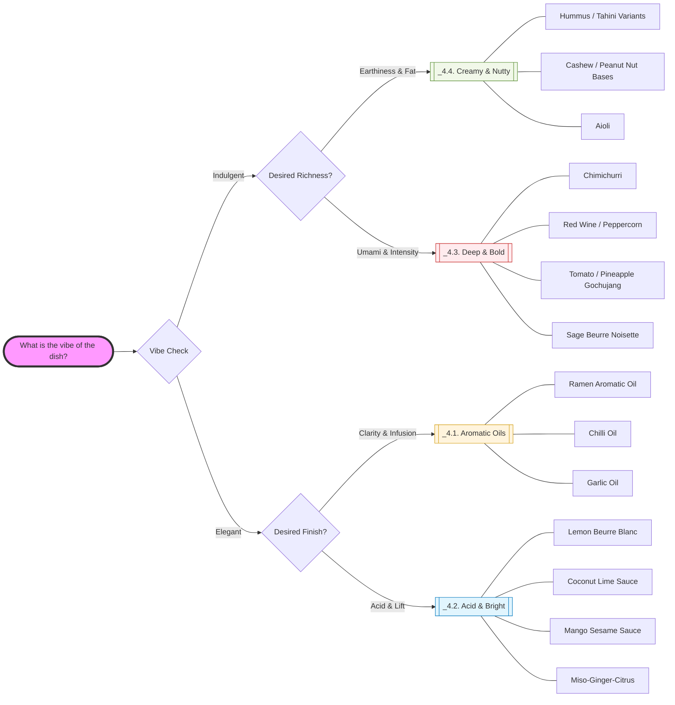

### Side info
- group: sideinfo
- subgroup: sideinfo

### Title:
- title: Distinct Sauces

### Text
When pairing a sauce with a vegetable:
1. **Start with flavor:** Match the sauce flavor to complement or contrast the vegetable (e.g., bright sauce with bitter greens, nutty sauce with roasted root vegetables).
2. **Check the weight:** Ensure the richness of the sauce balances the density of the vegetable. Light sauces for delicate veggies, heavy sauces for dense or fried items.
3. **Decide use mode:** Consider how the sauce will interact with the vegetable in the dish — tossed, drizzled, dipped, spread, or glazed.

#### Flavor Profile
What it tastes like

- Bright (citrus, vinegar-forward)
- Creamy (tahini, nut, mayo-style)
- Nutty
- Umami
- Herbal
- Sweet
- Savory
- Spicy
- Fresh

#### Weight
How heavy it feels in the dish

- Light – vinaigrettes, soy/citrus
- Medium – tahini, yogurt-style, loose nut sauces
- Heavy – thick nut butter, mayo
- Sticky – glazes, reduced sauces

#### Use Mode
How it’s meant to be applied

- Dip
- Drizzle
- Spread
- Glaze
- Toss
