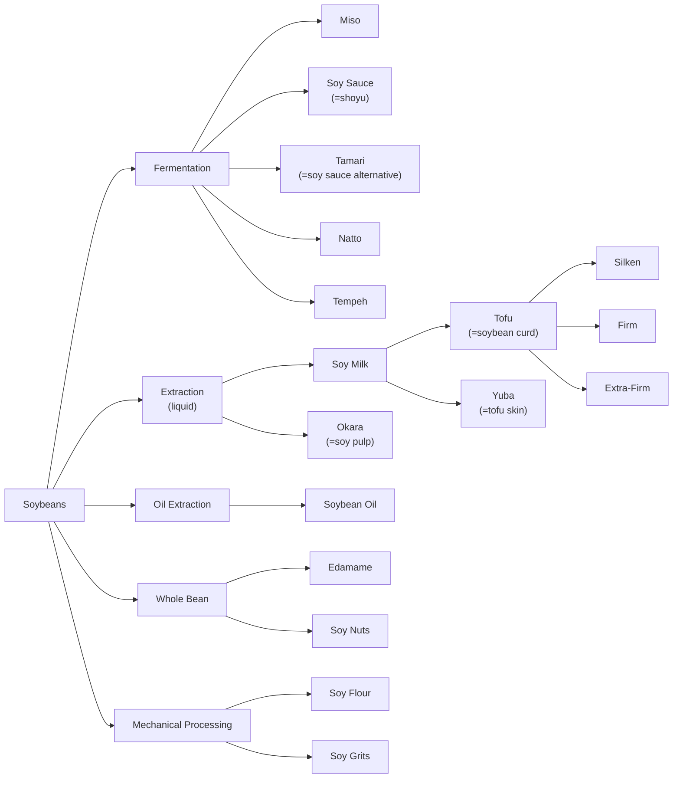

### Text

```mermaid
flowchart LR
    S[Soybeans]

    S --> F[Fermentation]
    F --> M[Miso]
    F --> SS["Soy Sauce<br/>(=shoyu)"]
    F --> T["Tamari<br/>(=soy sauce alternative)"]
    F --> N[Natto]
    F --> TE[Tempeh]

    S --> EL["Extraction<br/>(liquid)"]
    EL --> SM[Soy Milk]
    SM --> TO["Tofu<br/>(=soybean curd)"]
    TO --> SI[Silken]
    TO --> FI[Firm]
    TO --> EF[Extra-Firm]
    SM --> Y["Yuba<br/>(=tofu skin)"]
    EL --> O["Okara<br/>(=soy pulp)"]

    S --> OE[Oil Extraction]
    OE --> SO[Soybean Oil]

    S --> WB[Whole Bean]
    WB --> E[Edamame]
    WB --> SN[Soy Nuts]

    S --> MP[Mechanical Processing]
    MP --> SF[Soy Flour]
    MP --> SG[Soy Grits]

```

### Side info
- group: sideinfo
- subgroup: sideinfo

### Title
- title: Soy beans - Derivatives
